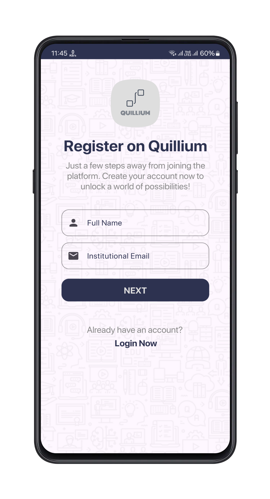
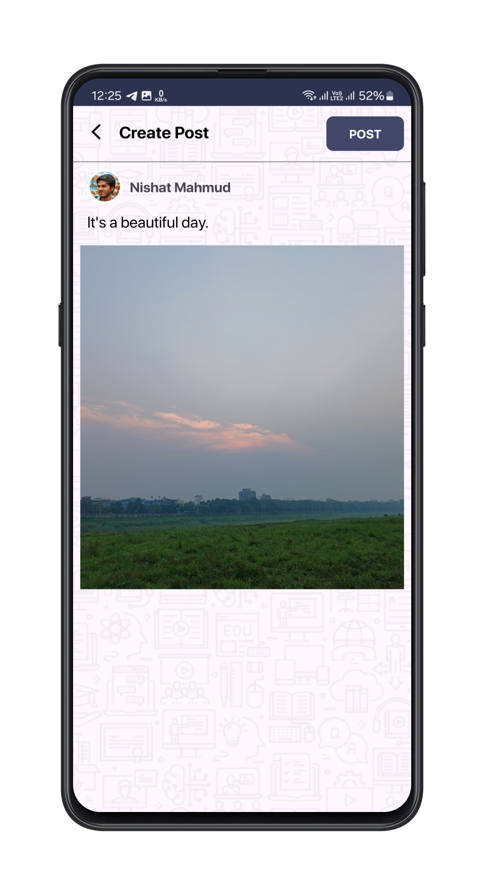

# <p align="center">Quillium - A university based social media platform</p><hr>

## Scan the QR code below to download Quillium directly to your Android device


## About The Project
Quillium is an Android app that allows university students to register with their specific university email address and join a social media platform where they can post, upload stories, like, comment, share, send friend requests, receive notifications, manage their own profile, and message each other.

The main goal of this project is to create a platform where university students can interact and network with each other, share their academic and personal experiences, and access useful information and resources related to their studies and campus life.

### Built With
This project is built with the following technologies:

- Android Studio
- Firebase
- Glide
- CircleImageView

## Detail Description of Quillium
To use the app, you need to sign up with a valid university email address and a password. After verifying your email, you can log in and access the main features of the app, such as:

- Home: You can see the posts from other users, like and comment on them, and create your own posts with text, images, or videos.
- Stories: You can see the stories from other users, react to them, and upload your own stories with images or videos.
- Friends: You can see the list of your friends, send and accept friend requests, and search for other users by name or email.
- Chat: You can see the list of your conversations, send and receive text messages, images, or videos, and delete messages or conversations.
- Notifications: You can see the list of your notifications, such as likes, comments, friend requests, and messages, and tap on them to view the details.
- Profile: You can see your profile information, such as name, email, bio, profile picture, and cover photo, and edit them as you wish. You can also see your posts and stories, and log out from the app.

## Getting Started
To get a local copy up and running, follow these simple steps.

### Prerequisites
You need to have the following software installed on your computer:

- Android Studio
- Git

### Installation
1. Clone the repository
   ```sh
   git clone https://github.com/nishatrhythm/Quillium.git

## Contributing
Contributions are what makes the open-source community such an amazing place to learn, inspire, and create. Any contributions you make are greatly appreciated.

- Fork the project
- Create your feature branch (git checkout -b feature/AmazingFeature)
- Commit your changes (git commit -m 'Add some AmazingFeature')
- Push to the branch (git push origin feature/AmazingFeature)
- Open a pull request

## Credit
[@waliulrayhan](https://github.com/waliulrayhan)

## License
This project is licensed under the MIT License - see the <a href="LICENSE">LICENSE</a> file for details

## Screenshots

| App View (Screenshot 1) | App View (Screenshot 2) | App View (Screenshot 3) |
|--------------------------|--------------------------|--------------------------|
|  |  |  |

| App View (Screenshot 4) | App View (Screenshot 5) | App View (Screenshot 6) |
|--------------------------|--------------------------|--------------------------|
|  |  |  |
